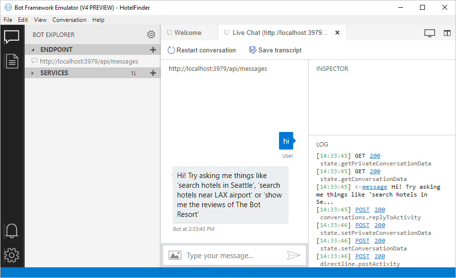

# Capstone-chatbot

## Prerequisites

* The latest update of Visual Studio 2015+. You can download the community version [here](http://www.visualstudio.com) for free.

* The Bot Framework Emulator. To install the Bot Framework Emulator, download it from [here](https://emulator.botframework.com/). See the [Getting Started](https://github.com/microsoft/botframework-emulator/wiki/Getting-Started) article to know more about the Bot Framework Emulator. The bot emulator is now v4.

## Run and test the sample

1. You will see a browser window open and display your localhost number in the address bar.

1. Open the Bot Emulator v4 application. 

1. You'll see the Welcome page where you can import a .bot file. If your samples is still using the bot v3 SDK, then you'll need to create your own .bot by clicking "Create a new bot configuration", located under the "Open Bot" button.

1. A popup appears that asks for your Bot Name (whatever you want to call it is fine) and your Endpoint URL. To find your endpoint, get them from the browser that opened when you ran the Visual Studio solution. You'll see your localhost port in the browser, go ahead and use it in part of your endpoint. You total endpoint should look something like this: `http://localhost:3979/api/messages`. You do not need to worry about providing a Microsoft App ID and a Microsoft APP Password (they are optional). Then choose "Save and connect". A .bot file gets created in your sample.

1. When you see `POST 201 directline.startConversation`, your bot is ready to receive text as input.

1. Start by typing "hi" in the chat window. It will respond with more usage instructions to follow.

NOTE: in order to use the chat client, the app must be running in Visual Studio.

Your emulator may look like this:

## More Information

To get more information about how to get started in Bot Builder for .NET and Conversations please review the following resources:
* [Bot Builder for .NET](https://docs.microsoft.com/en-us/bot-framework/dotnet/)
* [Add language understanding to a bot](https://docs.microsoft.com/en-us/bot-framework/cognitive-services-add-bot-language)
* [Cognitive Services LUIS Documentation](https://docs.microsoft.com/en-us/azure/cognitive-services/luis/home)
* [Specify initial form state and entities](https://docs.microsoft.com/en-us/bot-framework/dotnet/bot-builder-dotnet-formflow-advanced#specify-initial-form-state-and-entities)
* [Bing Spell Check API](https://www.microsoft.com/cognitive-services/en-us/bing-spell-check-api)

> **Limitations**  
> The functionality provided by the Bot Framework Activity can be used across many channels. Moreover, some special channel features can be unleashed using the [ChannelData property](https://docs.microsoft.com/en-us/bot-framework/dotnet/bot-builder-dotnet-channeldata).
> 
> The Bot Framework does its best to support the reuse of your Bot in as many channels as you want. However, due to the very nature of some of these channels, some features are not fully portable.
> 
> The features used in this sample are fully supported in the following channels:
> - Skype
> - Facebook
> - Microsoft Teams
> - DirectLine
> - WebChat
> - Slack
> - GroupMe
> 
> They are also supported, with some limitations, in the following channels:
> - Kik
> - Email
> 
> On the other hand, they are not supported and the sample won't work as expected in the following channels:
> - Telegram
> - SMS

